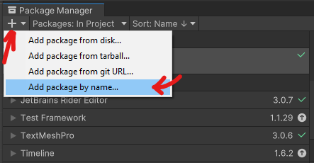

At the time of writing this (February of 2022), there are multiple ways of importing a package into a Unity project, and this post is a compilation of my findings regarding the use of the [UPM - Unity Package Manager](https://docs.unity3d.com/Manual/upm-ui.html).

> The Unity Package Manager was introduced on **[Unity 2017.2](https://blog.unity.com/technology/unity-2017-2-is-now-available)**

While testing the different services and possibilities, I was writing a document for myself, because I was getting lost every time I was testing a new service, and also it would be helpful for my future I remember the outcomes of that investigation.

> That post is not supposed to be a guide or tutorial. I'm writing it just to share my experience while dealing with UPM and my personal preferences about some NPM systems that we can use in combination with it.

Today I decided to format the document a little bit and share it with the community. It will not be a super technical and well-designed text, but I hope it could help somebody in the same situation I was before.

My initial intention for that post was to only show my personal pros and cons about some solutions for hosting packages as NPM and being able to install them into our project via the Unity Package Manager + Scoped Registries, but I couldn't resist my desire to tell a short story about the UPM + Git Dependencies, because I also spent quite some time investigating about it. So here we go!

## Unity Package Manager + Git Dependencies
Back in 2020, I started to create Unity packages and in the learning process, I was disappointed that Unity Package Manager does not work with git dependencies. 

Then, I decided to create a system to resolve Git Dependencies inside custom packages installed in a Unity project via UPM . You can take a look at that package here: https://GitHub.com/sandolkakos/unity-package-manager-utilities

> You can also take a look at some discussion regarding UPM + Git dependencies on the Unity forums: https://forum.unity.com/threads/custom-package-with-git-dependencies.628390/

Well, at that time I'd seen people talking about scoped registries, but I didn't pay attention because I was too much focused on the fact that UPM couldn't resolve git dependencies and decided to create the package above, which was an acceptable solution for the moment being.

## Unity Package Manager + Scoped Registries
About one year later, I was still not comfortable with the fact that to import a list of packages, I would need to copy a git URL for every package. I would really love to see all my packages on the UPM window and just click a button to install all of them.

Then I ended up having to learn about NPM packages and how to use them on Unity via Unity Package Manager + Scoped Registries. You can read about it here:
https://docs.unity3d.com/Manual/upm-scoped.html

If you are familiar with NPM packages, you will notice that Unity does not handle the package names the same way as the big majority of the other tools manage to do.

```
Instead of: @companyname/packagename
Unity uses: com.companyname.packagename 
```

Because of that, I lost a lot of time trying to figure out how to make Unity work with GitLab Package Registry, for instance. 
> We can use GitLab to host Unity Packages but unfortunately, the packages would never get listed on the UPM window. 

So every time I was trying different settings, different package names (with and without the `@companyname/`), always thinking that my settings were wrong but in the end, I just found out that the way Unity requests the list of packages is not supported by GitLab and other NPM Registry services, like NPMJS, GitHub, AWS CodeArtifact, and so on.

> When using **Verdaccio** and **JFrog** registries, the Unity Package Manager will list all the packages and I'm gonna talk about them in that document.

So, after a lot of time trying different stuff, I had an idea of using the menu below to add a package by name while my GitLab Scoped Registry URL was added to Unity Package Manager settings, and "voilà"! the package was installed with success.



That also means, that if your packages have dependencies to each other or to packages from Unity Registries or any other Scoped Registries added to your project, Unity can resolve all the dependencies properly.

> The UPM will not list the "unknown" packages, but as soon as the package name is informed, be it by adding the package name manually or by another package requesting it via dependency, it will just work.

With that solution, both the projects and packages could be hosted on the same service, for instance, GitLab or GitHub. For some people that would be enough, but not for me, so I needed to try more solutions.

For me, the perfect match would require the solution to have those features:

##### The host:
```
- An NPM registry to host the packages
- Private for defined users
- History of package versions
```
##### The client:
```
- All packages hosted in the registry should appear in the UPM window
- The dependencies should be automatically resolved
```
---

## Investigation Results

I've tested 5 systems and described the Pros/Cons for every one of them. My personal ranking of better solutions based on my investigation is:

1. **JFrog**
2. **Verdaccio + GitLab** _(using Uplink)_
3. **Verdaccio**
4. **GitLab**
5. **AWS CodeArtifact**
6. **NPMJS**
---

### Verdaccio

Verdaccio is an open-source NPM application that we can install on a Linux server and then be able to publish and install NPM packages.

> Verdaccio website: https://verdaccio.org/

The only issue I have found so far is that when we try to publish a big package, the process of publishing can take a long time and the Socket connection would get a timeout, which makes it not possible to publish the package.

Maybe there is a way of fixing that issue, but at the moment I have tried multiple settings on the Verdaccio installation and Linux machine and nothing worked.

> There is a feature where we can link multiple external registries to the Verdaccio one. That would give us access to install packages from those registries directly via the Verdaccio connection.
> - [Linking a Remote Registry | Verdaccio](https://verdaccio.org/docs/linking-remote-registry/)
> - [Caching strategies | Verdaccio](https://verdaccio.org/docs/caching)

> I was able to link the GitLab registry, and using `cache: false` makes Verdaccio behaves only as a proxy to reach GitLab and download the requested version.

The Metadata structure stored by GitLab does not contain most of the details used by the UMP. That means when a package is installed, its name and authour is not properly displayed in the UPM window and the Project.
```
- displayName: "com.companyname.packagename" instead of the display name set in the package.json
- author: "Packages - Other" instead of the author.name set in the package.json
```

##### Pros:
```
- Free and open-source
- Has a website to show the packages
- All packages are visible on the Unity Package Manager
- Uplinks and Proxy system
```

##### Cons:
```
- We need to maintain a Linux server to run the service
- Requires a bit of learning in order to:
  - set a private registry
  - set the service to run in the background and 24/7 hour availability
- Hard or impossible to fix basic issues like the timeout one
```

##### The scopedRegistries in your manifest.json should be set like:
```json
"scopedRegistries": [
  { 
    "name": "My Verdaccio Registry",
    "url": "http://localhost:4873",
    "scopes": [
      "com.mycompanyname", 
      "com.othercompanyname" 
    ] 
  } 
]
```
##### The .upmconfig.toml authentication file should be set like:
```json
[npmAuth."http://localhost:4873"]
token = "<AUTH TOKEN (_authToken in .npmrc)>"
alwaysAuth = true
```

---
### JFrog
JFrog is a platform that contains some cloud solutions and one of them is the JFrog Artifactory, which we can use to manage NPM Packages.

> JFrog website: https://jfrog.com/

While testing, it matches perfectly my requirements of usage.

> It is said that Unity Registry is hosted on JFrog, but I cannot confirm it.

##### Pros:
```
- All packages are visible on the Unity Package Manager
- The dependencies can be auto resolved
- Does not have the timeout problem found on Verdaccio
- We do not need to maintain a Linux service
- Its free plan is enough for a starting point and has a cheaper upgrade plan with more storage and transfer amount
```
##### Cons:
```
- Free plan with some important limits:
  - 2GB Storage
  - 10GB Transfer per month
- The Enterprise plan is quite expensive
```

##### The scopedRegistries in your manifest.json should be set like:
```json
"scopedRegistries": [
  {
    "name": "My JFrog Registry",
    "url": "https://mycompanyname.jfrog.io/artifactory/api/npm/default-npm-local",
    "scopes": [
      "com.mycompanyname",
      "com.othercompanyname"
    ]
  }
]
```

##### The .upmconfig.toml authentication file should be set like:
```json
[npmAuth."https://mycompanyname.jfrog.io/artifactory/api/npm/default-npm-local"]
_auth = "<BASE64 ENCODED TOKEN (_auth in .npmrc)>"
alwaysAuth = true
```

---
### GitLab

We can store packages into any project created on GitLab and because of that we could choose between:
```
- Storing every package on the same project that hosts the git repository of that package.
or
- Creating a unique project to store all our packages in one place
```

Once a package is published with success, it can be found in a url like that:
https://gitlab.com/{PATH_TO_PROJECT}/-/packages/

##### Pros:
```
- Does not have the timeout problem found on Verdaccio
- The dependencies can be auto resolved (despite the packages being not visible on the UPM)
- We do not need to maintain a Linux service
- It is included in the free plan
```

##### Cons:
```
- Packages are NOT visible on the Unity Package Manager
- To install a package, we need to use the UPM option: add package by name…
  - At least the dependencies will be resolved automatically
- The Metadata structure stored by GitLab does not contain most of the details used by the UMP
  - That means when a package is installed, it is not properly displayed in the list (Folder and UMP):
    - displayName: "com.companyname.packagename" instead of the display name set in the package.json
    - author: "Packages - Other" instead of the author.name set in the package.json
- I was not able to publish a package running the command line from my machine
  - it worked only running on the Docker using the CI/CD pipeline
- The packages in the dashboard are not grouped by name as we see in all the others
  - But at least, when going inside any package, it has a Tab to see Other Versions
```

##### The scopedRegistries in your manifest.json should be set like:
```json
"scopedRegistries": [
  {
    "name": "My GitLab Registry",
    "url": "https://gitlab.com/api/v4/projects/{YOUR_PROJECT_ID}/packages/npm",
    "scopes": [
      "com.mycompanyname",
      "com.othercompanyname"
    ]
  }
]
```

##### The .upmconfig.toml authentication file should be set like:
```json
[npmAuth."https://gitlab.com/api/v4/projects/{YOUR_PROJECT_ID}/packages/npm"]
token = "<AUTH TOKEN (_authToken in .npmrc)>"
alwaysAuth = true
```

---
### AWS CodeArtifact

CodeArtifact is an AWS Service where we can create repositories and use them to store NPM packages.

##### Pros:
```
- Does not have the timeout problem found on Verdaccio
- Does show the package`s name and author correctly on the UPM
- The dependencies can be auto resolved (despite the packages being not visible on the UPM)
- We do not need to maintain a Linux service
- The costs of that AWS Service are quite cheap
```

##### Cons:
```
- CodeArtifact authorization tokens are valid for a default period of 12 hours
  - That requires the client to refresh the token every 12 hours, and copy the new token to `.upmconfig.toml` file
- Packages are NOT visible on the Unity Package Manager
- To install a package, we need to use the UPM option: add package by name…
  - At least the dependencies will be resolved automatically
- If a user would like to see the list of published packages, we would need to give AWS access to that user
- There is no option on the dashboard to download the package manually
```

##### The scopedRegistries in your manifest.json should be set like:
```json
"scopedRegistries": [
  {
    "name": "My AWS CodeArtifact Registry",
    "url": "{URL PROVIDED IN THE CONNECTION INSTRUCTIONS}",
    "scopes": [
      "com.mycompanyname",
      "com.othercompanyname"
    ]
  }
]
```

##### The .upmconfig.toml authentication file should be set like:
```json
[npmAuth."{URL PROVIDED IN THE CONNECTION INSTRUCTIONS}"]
token = "<AUTH TOKEN (_authToken in .npmrc)>"
alwaysAuth = true
```

---
### NPMJS
The default platform for storing NPM packages.

##### Pros:
```
- Does not have the timeout problem found on Verdaccio
- Does show the package`s name and author correctly on the UPM.
- The dependencies can be auto resolved (despite the packages being not visible on the UPM)
- We do not need to maintain a Linux service
```

##### Cons:
```
- Private packages are possible only for paid accounts.
- Packages are NOT visible on the Unity Package Manager
- To install a package, we need to use the UPM option: add package by name…
- At least the dependencies will be resolved automatically
```

##### The scopedRegistries in your manifest.json should be set like:
```json
"scopedRegistries": [
  {
    "name": "NPMJS public Registry",
    "url": "https://registry.npmjs.org",
    "scopes": [
      "com.mycompanyname",
      "com.othercompanyname"
    ]
  }
]
```
> Since that is a public registry, there is no need for authorization.

---

### Conclusion
I hope this loooong post helps you to decide which technology would be a good fit for you or which one you wouldn't even try 😆

That was my first time blogging about development. It has been quite some time I think about having a blog to register my learnings and it was always being postponed due to other priorities. But now that I have this blog in place, I will try to get myself used to write whenever I have something new to share.